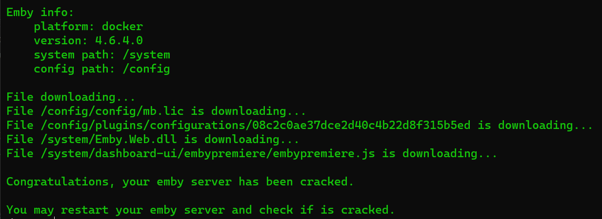
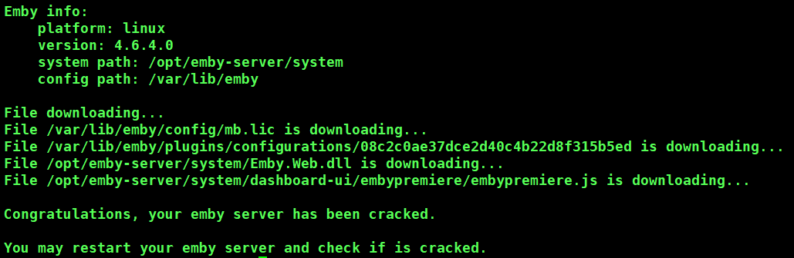
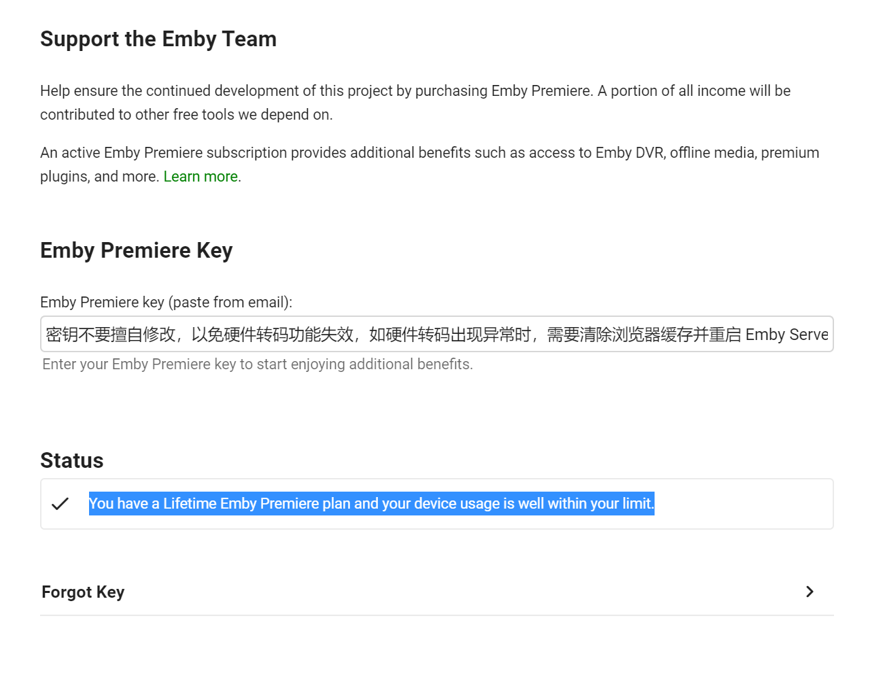

## 使用方法
Linux直装版可以直接下载运行该脚本，docker版则需要进入到容器运行该脚本。
```shell
# docker进入容器，其中emby为你的emby容器名
docker exec -it emby /bin/sh
```
```shell
# 下载脚本
wget --no-check-certificate https://cdn.jsdelivr.net/gh/qcgzxw/emby-server-crack@main/embyServerCrack.sh -O embyServerCrack.sh

# 管理员权限运行脚本
sh embyServerCrack.sh
```

## 成品图
Docker:

Linux：

Server:



## 支持平台
- [x] docker
- [x] linux直装
- [ ] 群晖
- [ ] 其他

## todo
- [x] 本地破解
- [ ] 界面优化包
- [ ] 插件

## 参考
- 破解文件来自TG资源频道 https://t.me/EmbyNoisyX/61
